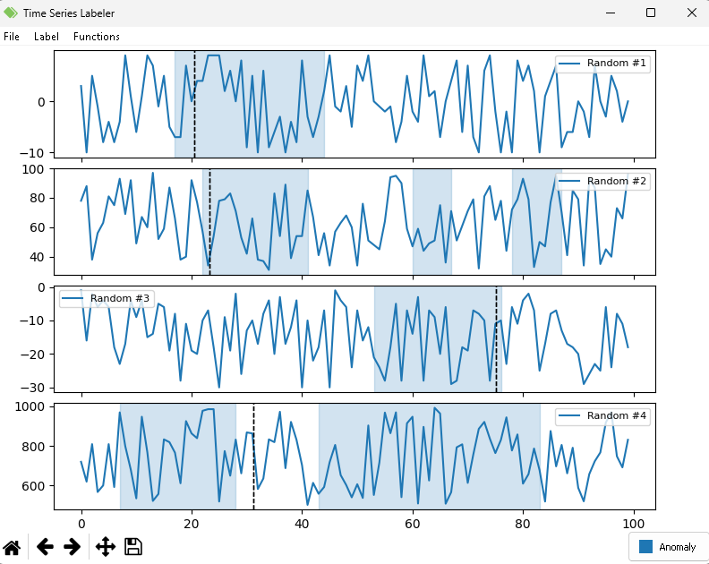

# Time Series Labeler &emsp;&emsp;&emsp;   

This is a fork of *Time Series Labeler* (TSL), a Python tool for time series analysis and labeling, now enhanced to support multi-channel independent labeling.

## Features
- Multi-channel independent labeling
- Works with single files and projects
- Customizable labels and plot layouts
- Mouse and keyboard bindings for quick operations
- Zoom in/out with downsampling for large series
- Signal processing with customizable functions

## Requirements
- [Python 3](https://www.python.org/)
- [Numpy](https://www.numpy.org/)
- [Pandas](https://pandas.pydata.org/)
- [Matplotlib 3.1.0](https://matplotlib.org/)
- [PyQT5](https://pypi.org/project/PyQt5/)
- [lttb.py](https://github.com/javiljoen/lttb.py)
