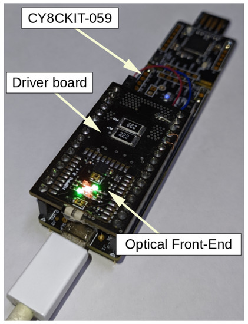

The MW-PPG dataset is a three-channel dataset specifically designed for the analysis of photoplethysmographic (PPG) signals. It focuses on three measurement channels corresponding to green, red, and near-infrared (NIR) wavelengths. These signals are captured using a sensor unit equipped with photodetectors and LEDs, optimized for specific wavelengths. The dataset offers high-resolution data, making it suitable for signal processing and machine learning applications.

The three wavelengths utilized are:
- Green: 525 nm
- Red: 631 nm
- Near-infrared: 940 nm

For visible wavelengths, the dataset employs the VLMx1300 series LEDs from Vishay Semiconductors, while the WL-SICW LED from Würth Elektronik is used for the NIR wavelength. The photodetector (PD) model TEMD5010X01 from Vishay Semiconductors is selected, featuring a detection area of 0.23 mm² and a relative sensitivity angle of ±60°. With a spectral sensitivity range of 400 to 1100 nm, these PDs are capable of detecting both visible and NIR light. The signals are digitized using the CY8CKIT-059 module, which provides an 18-bit resolution and a sampling rate of 125 Hz.

To enhance the dataset, data augmentation techniques are applied to increase its size and diversity. These techniques simulate channel-specific anomalies such as signal dropout, clipping, and other sensor-related artifacts. Additionally, data augmentation is used to generate variations of the original signals, enriching the dataset for training purposes. The Python package Tsaug is utilized for creating training samples and introducing new types of channel anomalies.

To cite this dataset, use:

        @article{baciu2023anomaly,
          title={Anomaly Detection in Multi-Wavelength Photoplethysmography Using Lightweight Machine Learning Algorithms},
          author={Baciu, Vlad-Eusebiu and Lambert Cause, Joan and Sol{\'e} Morillo, {\'A}ngel and Garc{\'\i}a-Naranjo, Juan C and Stiens, Johan and da Silva, Bruno},
          journal={Sensors},
          volume={23},
          number={15},
          pages={6947},
          year={2023},
          publisher={MDPI}
        }